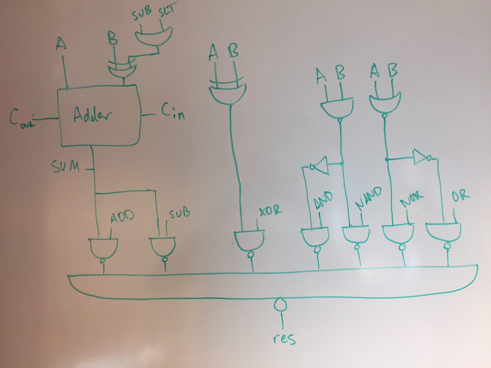
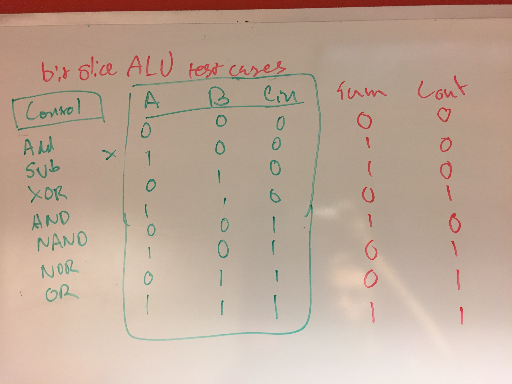

# Lab 1 Writeup
### Taylor Sheneman and Alexander Hoppe


## Initial Planning Phase

Our plan was to sketch out a design for the ALU, then implement the testing procedures from that design and finally finish the implementation while continuously using the test benches for validation.



## Developing Test Benches

 We started our test-driven development by developing an exhaustive test protocol for a single bit slice, based on a single looping module through the three possible 1-bit inputs to the bit slice, `CIN`, `A`, and `B`.



To verify our test benches were detecting failures, first we added dummy code to make sure it would fail.
```verilog
// TODO This is fake testing code
    assign cout = 0;
    assign res = 0;
    assign sum = 0;
```


As expected, we achieved the following failures for the logic-gate only portion of the exhaustive tests. Since the output is always zero, we expected six failures for OR and NAND, two failures for NOR and AND, and four failures for XOR.
```
VCD info: dumpfile BitSlice.vcd opened for output.
Test Case OR Cin:0 A:0 B:1 Failed, Got 0 Expected 1
Test Case OR Cin:0 A:1 B:0 Failed, Got 0 Expected 1
Test Case OR Cin:0 A:1 B:1 Failed, Got 0 Expected 1
Test Case OR Cin:1 A:0 B:1 Failed, Got 0 Expected 1
Test Case OR Cin:1 A:1 B:0 Failed, Got 0 Expected 1
Test Case OR Cin:1 A:1 B:1 Failed, Got 0 Expected 1
Test Case NOR Cin:0 A:0 B:0 Failed, Got 0 Expected 1
Test Case NOR Cin:1 A:0 B:0 Failed, Got 0 Expected 1
Test Case NAND Cin:0 A:0 B:0 Failed, Got 0 Expected 1
Test Case NAND Cin:0 A:0 B:1 Failed, Got 0 Expected 1
Test Case NAND Cin:0 A:1 B:0 Failed, Got 0 Expected 1
Test Case NAND Cin:1 A:0 B:0 Failed, Got 0 Expected 1
Test Case NAND Cin:1 A:0 B:1 Failed, Got 0 Expected 1
Test Case NAND Cin:1 A:1 B:0 Failed, Got 0 Expected 1
Test Case AND Cin:0 A:1 B:1 Failed, Got 0 Expected 1
Test Case AND Cin:1 A:1 B:1 Failed, Got 0 Expected 1
Test Case XOR Cin:0 A:0 B:1 Failed, Got 0 Expected 1
Test Case XOR Cin:0 A:1 B:0 Failed, Got 0 Expected 1
Test Case XOR Cin:1 A:0 B:1 Failed, Got 0 Expected 1
Test Case XOR Cin:1 A:1 B:0 Failed, Got 0 Expected 1
```
