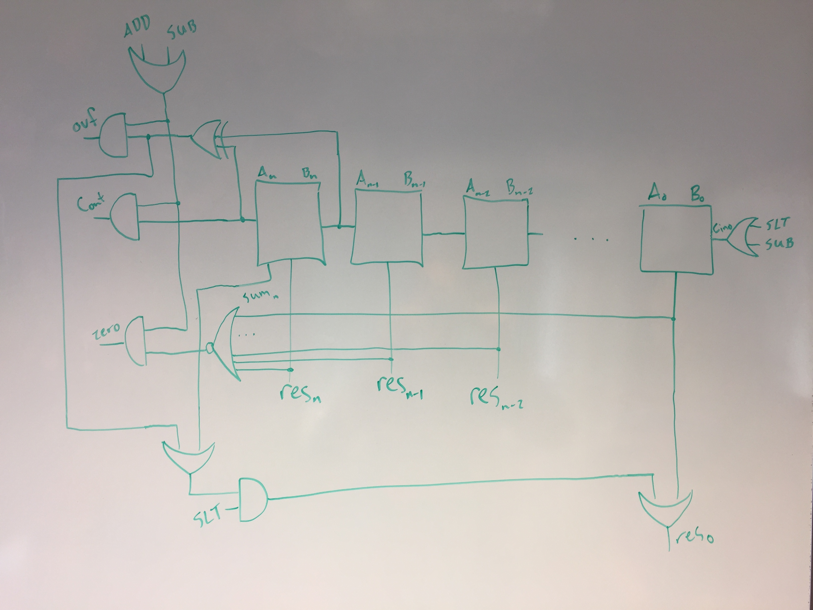
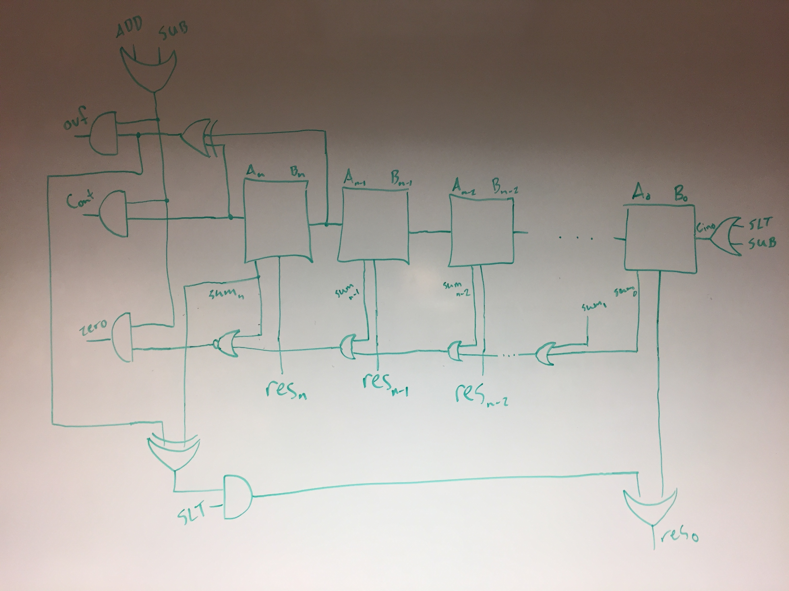
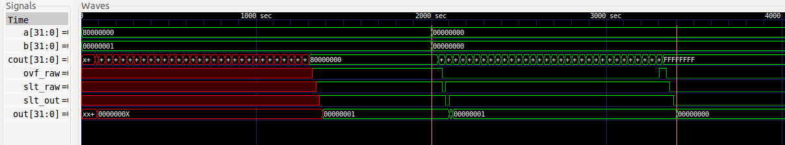

# Lab 1 Writeup
### Taylor Sheneman and Alexander Hoppe


## Initial Planning Phase

Our plan was to sketch out a design for the ALU, then implement the testing procedures from that design, and finally finish the implementation while continuously using the test benches for validation. We started by planning the structure of a single bit slice, as shown.


## Developing Test Benches

 We started our test-driven development by developing an exhaustive test protocol for a single bit slice, based on a single looping module through the three possible 1-bit inputs to the bit slice, `CIN`, `A`, and `B`.


To verify our test benches were detecting failures, first we added dummy code to make sure it would fail.
```verilog
// TODO This is fake testing code
    assign cout = 0;
    assign res = 0;
    assign sum = 0;
```


As expected, we achieved the following failures for the logic-gate only portion of the exhaustive tests. Since the output is always zero, we expected six failures for `OR` and `NAND`, two failures for `NOR` and `AND`, and four failures for `XOR`.
```
VCD info: dumpfile BitSlice.vcd opened for output.
Test Case OR Cin:0 A:0 B:1 Failed, Got 0 Expected 1
Test Case OR Cin:0 A:1 B:0 Failed, Got 0 Expected 1
Test Case OR Cin:0 A:1 B:1 Failed, Got 0 Expected 1
Test Case OR Cin:1 A:0 B:1 Failed, Got 0 Expected 1
Test Case OR Cin:1 A:1 B:0 Failed, Got 0 Expected 1
Test Case OR Cin:1 A:1 B:1 Failed, Got 0 Expected 1
Test Case NOR Cin:0 A:0 B:0 Failed, Got 0 Expected 1
Test Case NOR Cin:1 A:0 B:0 Failed, Got 0 Expected 1
Test Case NAND Cin:0 A:0 B:0 Failed, Got 0 Expected 1
Test Case NAND Cin:0 A:0 B:1 Failed, Got 0 Expected 1
Test Case NAND Cin:0 A:1 B:0 Failed, Got 0 Expected 1
Test Case NAND Cin:1 A:0 B:0 Failed, Got 0 Expected 1
Test Case NAND Cin:1 A:0 B:1 Failed, Got 0 Expected 1
Test Case NAND Cin:1 A:1 B:0 Failed, Got 0 Expected 1
Test Case AND Cin:0 A:1 B:1 Failed, Got 0 Expected 1
Test Case AND Cin:1 A:1 B:1 Failed, Got 0 Expected 1
Test Case XOR Cin:0 A:0 B:1 Failed, Got 0 Expected 1
Test Case XOR Cin:0 A:1 B:0 Failed, Got 0 Expected 1
Test Case XOR Cin:1 A:0 B:1 Failed, Got 0 Expected 1
Test Case XOR Cin:1 A:1 B:0 Failed, Got 0 Expected 1
```

While writing the expected/actual comparisons in our actual test loops, we learned that the RTL operations didn't seem to have strictly tighter binding than the comparison operators, and explicitly needed parentheses. i.e. `res != A|B` is not the same as `res != (A|B)`

```
VCD info: dumpfile BitSlice.vcd opened for output.
Test Case OR Cin:0 A:0 B:1 Failed, Got 1 Expected 1
Test Case OR Cin:0 A:1 B:1 Failed, Got 1 Expected 1
Test Case OR Cin:1 A:0 B:1 Failed, Got 1 Expected 1
Test Case OR Cin:1 A:1 B:1 Failed, Got 1 Expected 1
Test Case NAND Cin:0 A:0 B:0 Failed, Got 1 Expected 1
Test Case NAND Cin:0 A:1 B:0 Failed, Got 1 Expected 1
Test Case NAND Cin:1 A:0 B:0 Failed, Got 1 Expected 1
Test Case NAND Cin:1 A:1 B:0 Failed, Got 1 Expected 1
Test Case ADD Cin:1 A:0 B:1 Failed, Got Cout:1 Expected Cout:1
Test Case ADD Cin:1 A:1 B:0 Failed, Got Cout:1 Expected Cout:1
Test Case SUB Cin:1 A:0 B:0 Failed, Got Cout:1 Expected Cout:1
Test Case SUB Cin:1 A:1 B:1 Failed, Got Cout:1 Expected Cout:1
Tests Passed
```

None of these failed after adding parentheses; the bit slice functioned as intended. The only change we made to the bit slice design after this point was to add the `SLT` flag (in the `SLT||SUB` component at the top of the above diagram) to the adder input. Previously, the only input to the `XOR` with `B` was `SUB`, but we wanted to make our control logic simpler by adopting a purely "one-hot" design for control line inputs.

## Four Bit ALU

We then sketched out an initial plan for the constant-time logic outside of the bit slices, as below. We decided to first implement a 4-bit ALU to validate this logic exhaustively before moving on to 32 bits.



Much of the constant-time logic was familiar from our previous 4-bit adder design, with the exception of the set-less-than logic, and the `ADD||SUB` line for selectively enabling the `cout`, `ovf` and `zero` flags. We had some syntax trouble writing the test benches for this design, to the point where we noticed a flaw in the set-less-than logic before getting any useful information from the test suite.

In the above diagram, the input to the `SLT` enable line is an `OR` gate connected to the overflow line and the most-significant-bit sum line, under the assumption that the subtraction of a larger number from a smaller number would always result in a negative number or an overflow. We failed to account for the case in which a negative number subtracted from a positive number may also overflow, in which case both `ovf` and the final `sum` would be high, incorrectly triggering `SLT`. We fixed this by replacing the `OR` with an `XOR`.

The other design change we made at this point was to re-engineer our logic for triggering the `zero` flag. Realizing that our many-input `NOR` gate connected to all the output lines would result in a massive constant delay *after* the final sum line was calculated, we expanded the logic to a series of `OR` gates connected to each sum line in series, and a final `NOR` gate to ensure that the `zero` flag would only be set if all outputs are zero.

This is our final ALU design, with these changes incorporated.



## 32-bit ALU

Once the four-bit design was complete and the exhaustive tests all passed, it was fairly simple to expand the design to 32 bits. With the exception of the first bit slice, which requires I/O slightly different from all other cases, we automated the creation of the bit slices with a `generate` block, connecting each `CIN` to the previous `cout`. We also wrote a `generate` statement for the chain of zero-flag-checking `OR` gates, which required slightly different formats for the first and last in the series. Otherwise, the code is identical to that of the four-bit case.

We were pretty confident that our design would function largely identically to the exhaustively-tested four-bit case, with the exception of timing. We formulated the worst-case delay that we could come up with, along with a handful of other interesting cases to validate the functionality of all bit slices.

Testing all boolean logic blocks. Each bit slice produces entirely independent output for these operations, so these serve as exhaustive tests.

```
Test XOR A:00000000000000000000000000000000 B:00000000000000000000000000000000 Passed, Expected Out:00000000000000000000000000000000 Got Out:00000000000000000000000000000000
Test XOR A:11111111111111111111111111111111 B:00000000000000000000000000000000 Passed, Expected Out:11111111111111111111111111111111 Got Out:11111111111111111111111111111111
Test XOR A:00000000000000000000000000000000 B:11111111111111111111111111111111 Passed, Expected Out:11111111111111111111111111111111 Got Out:11111111111111111111111111111111
Test XOR A:11111111111111111111111111111111 B:11111111111111111111111111111111 Passed, Expected Out:00000000000000000000000000000000 Got Out:00000000000000000000000000000000

Test AND A:00000000000000000000000000000000 B:00000000000000000000000000000000 Passed, Expected Out:00000000000000000000000000000000 Got Out:00000000000000000000000000000000
Test AND A:11111111111111111111111111111111 B:00000000000000000000000000000000 Passed, Expected Out:00000000000000000000000000000000 Got Out:00000000000000000000000000000000
Test AND A:00000000000000000000000000000000 B:11111111111111111111111111111111 Passed, Expected Out:00000000000000000000000000000000 Got Out:00000000000000000000000000000000
Test AND A:11111111111111111111111111111111 B:11111111111111111111111111111111 Passed, Expected Out:11111111111111111111111111111111 Got Out:11111111111111111111111111111111

Test NAND A:00000000000000000000000000000000 B:00000000000000000000000000000000 Passed, Expected Out:11111111111111111111111111111111 Got Out:11111111111111111111111111111111
Test NAND A:11111111111111111111111111111111 B:00000000000000000000000000000000 Passed, Expected Out:11111111111111111111111111111111 Got Out:11111111111111111111111111111111
Test NAND A:00000000000000000000000000000000 B:11111111111111111111111111111111 Passed, Expected Out:11111111111111111111111111111111 Got Out:11111111111111111111111111111111
Test NAND A:11111111111111111111111111111111 B:11111111111111111111111111111111 Passed, Expected Out:00000000000000000000000000000000 Got Out:00000000000000000000000000000000

Test NOR A:00000000000000000000000000000000 B:00000000000000000000000000000000 Passed, Expected Out:11111111111111111111111111111111 Got Out:11111111111111111111111111111111
Test NOR A:11111111111111111111111111111111 B:00000000000000000000000000000000 Passed, Expected Out:00000000000000000000000000000000 Got Out:00000000000000000000000000000000
Test NOR A:00000000000000000000000000000000 B:11111111111111111111111111111111 Passed, Expected Out:00000000000000000000000000000000 Got Out:00000000000000000000000000000000
Test NOR A:11111111111111111111111111111111 B:11111111111111111111111111111111 Passed, Expected Out:00000000000000000000000000000000 Got Out:00000000000000000000000000000000

Test OR A:00000000000000000000000000000000 B:00000000000000000000000000000000 Passed, Expected Out:00000000000000000000000000000000 Got Out:00000000000000000000000000000000
Test OR A:11111111111111111111111111111111 B:00000000000000000000000000000000 Passed, Expected Out:11111111111111111111111111111111 Got Out:11111111111111111111111111111111
Test OR A:00000000000000000000000000000000 B:11111111111111111111111111111111 Passed, Expected Out:11111111111111111111111111111111 Got Out:11111111111111111111111111111111
Test OR A:11111111111111111111111111111111 B:11111111111111111111111111111111 Passed, Expected Out:11111111111111111111111111111111 Got Out:11111111111111111111111111111111
```

Testing individual carryouts, on the end cases. All the middle cases are identical, so we used the first two and the last two to validate this functionality.

```
Test ADD A:00000000000000000000000000000001 B:00000000000000000000000000000001 Passed, Expected Out:00000000000000000000000000000010 Got Out:00000000000000000000000000000010
Test ADD A:00000000000000000000000000000010 B:00000000000000000000000000000010 Passed, Expected Out:00000000000000000000000000000100 Got Out:00000000000000000000000000000100
Test ADD A:01000000000000000000000000000000 B:01000000000000000000000000000000 Passed, Expected Out:10000000000000000000000000000000 Got Out:10000000000000000000000000000000
Test ADD A:10000000000000000000000000000000 B:10000000000000000000000000000000 Passed, Expected Out:00000000000000000000000000000000 Got Out:00000000000000000000000000000000
```

"All-bit" and simple overflow case.
```
Test ADD A:01111111111111111111111111111111 B:11111111111111111111111111111111 Passed, Expected Out:01111111111111111111111111111110 Got Out:01111111111111111111111111111110
Test ADD A:11111111111111111111111111111111 B:10000000000000000000000000000000 Passed, Expected Out:01111111111111111111111111111111 Got Out:01111111111111111111111111111111
```

Cases chosen to result in all possible combinations of inputs to the SLT logic: neither negative nor overflow, only negative, only overflow, and both.

```
Test SLT A:       5000 B:       5000 Passed, Expected Out: 0 Got Out:         0
Test SLT A:-2147483647 B: 2147483647 Passed, Expected Out: 1 Got Out:         1
Test SLT A:-1000000000 B:-2000000000 Passed, Expected Out: 0 Got Out:         0
Test SLT A: -300000000 B: -100000000 Passed, Expected Out: 1 Got Out:         1
Test SLT A: 1500000000 B: 1000000000 Passed, Expected Out: 0 Got Out:         0
```

Generic addition and subtraction cases, using positive-positive and negative-negative pairs.

```
Test ADD A:       5000 B:       5000 Passed, Expected Out:      10000 Got Out:     10000
Test ADD A:       5000 B:       5000 Passed, Expected cout:0 Got cout:0
Test ADD A:       5000 B:       5000 Passed, Expected ovf:0 Got ovf:0
Test ADD A:       5000 B:       5000 Passed, Expected zero:0 Got zero:0

Test ADD A:-1000000000 B:-2000000000 Passed, Expected Out: 1294967296 Got Out:1294967296
Test ADD A:-1000000000 B:-2000000000 Passed, Expected cout:1 Got cout:1
Test ADD A:-1000000000 B:-2000000000 Passed, Expected ovf:1 Got ovf:1
Test ADD A:-1000000000 B:-2000000000 Passed, Expected zero:0 Got zero:0

Test ADD A: -300000000 B: -100000000 Passed, Expected Out: -400000000 Got Out:3894967296
Test ADD A: -300000000 B: -100000000 Passed, Expected cout:1 Got cout:1
Test ADD A: -300000000 B: -100000000 Passed, Expected ovf:0 Got ovf:0
Test ADD A: -300000000 B: -100000000 Passed, Expected zero:0 Got zero:0

Test ADD A: 1500000000 B: 1000000000 Passed, Expected Out:-1794967296 Got Out:2500000000
Test ADD A: 1500000000 B: 1000000000 Passed, Expected cout:0 Got cout:0
Test ADD A: 1500000000 B: 1000000000 Passed, Expected ovf:1 Got ovf:1
Test ADD A: 1500000000 B: 1000000000 Passed, Expected zero:0 Got zero:0

Test SUB A:-2147483647 B: 2147483647 Passed, Expected Out:          2 Got Out:         2
Test SUB A:-2147483647 B: 2147483647 Passed, Expected cout:1 Got cout:1
Test SUB A:-2147483647 B: 2147483647 Passed, Expected ovf:1 Got ovf:1
Test SUB A:-2147483647 B: 2147483647 Passed, Expected zero:0 Got zero:0

Test SUB A:-1000000000 B:-2000000000 Passed, Expected Out: 1000000000 Got Out:1000000000
Test SUB A:-1000000000 B:-2000000000 Passed, Expected cout:1 Got cout:1
Test SUB A:-1000000000 B:-2000000000 Passed, Expected ovf:0 Got ovf:0
Test SUB A:-1000000000 B:-2000000000 Passed, Expected zero:0 Got zero:0

Test SUB A: -300000000 B: -100000000 Passed, Expected Out: -200000000 Got Out:4094967296
Test SUB A: -300000000 B: -100000000 Passed, Expected cout:0 Got cout:0
Test SUB A: -300000000 B: -100000000 Passed, Expected ovf:0 Got ovf:0
Test SUB A: -300000000 B: -100000000 Passed, Expected zero:0 Got zero:0

Test SUB A: 1500000000 B: 1000000000 Passed, Expected Out:  500000000 Got Out: 500000000
Test SUB A: 1500000000 B: 1000000000 Passed, Expected cout:1 Got cout:1
Test SUB A: 1500000000 B: 1000000000 Passed, Expected ovf:0 Got ovf:0
Test SUB A: 1500000000 B: 1000000000 Passed, Expected zero:0 Got zero:0
```

Zero-flag tests, for addition and subtraction.

```
Test ADD A:-2147483647 B: 2147483647 Passed, Expected Out:          0 Got Out:         0
Test ADD A:-2147483647 B: 2147483647 Passed, Expected cout:1 Got cout:1
Test ADD A:-2147483647 B: 2147483647 Passed, Expected ovf:0 Got ovf:0
Test ADD A:-2147483647 B: 2147483647 Passed, Expected zero:1 Got zero:1

Test SUB A:       5000 B:       5000 Passed, Expected Out:          0 Got Out:         0
Test SUB A:       5000 B:       5000 Passed, Expected cout:1 Got cout:1
Test SUB A:       5000 B:       5000 Passed, Expected ovf:0 Got ovf:0
Test SUB A:       5000 B:       5000 Passed, Expected zero:1 Got zero:1
```

Worst-case delay: starting with `ovf` and `SLT` high from one operation `-2147483648 SLT 1`, we move directly to a case `0 SLT 0` in which the result from the first bit slice propagates all the way to the final `COUT`, setting `ovf` to low and propagating through the `SLT` logic.

```
Test SLT A:10000000000000000000000000000000 B:00000000000000000000000000000001 Passed, Expected Out:00000000000000000000000000000001, Got Out:00000000000000000000000000000001
Test SLT A:00000000000000000000000000000000 B:00000000000000000000000000000000 Passed, Expected Out:00000000000000000000000000000000, Got Out:00000000000000000000000000000000
```

Extrapolating the calculations from our 4-bit full adder out to 32 bits and appending the `SLT` logic, we calculated a worst-case delay of 1480 time units. Our test bench was only waiting 1000 time units, so we had to increase the clock period.



Additions and subtractions should all be slightly faster (as they lack the extra SLT logic), coming out to 1440 for worst-case addition, and 1470 for subtraction. All the boolean logic is constant-time, as there is no chaining between bit slices, and has a worst-case delay of 110 for `NAND` and `NOR`, and 120 for `XOR`, `AND`, and `OR`.

## Work Plan Reflection

We were somewhat conservative on our time estimates for the actual ALU design, and made the questionable decision of subdividing the expected work by operation, which didn't correspond to how we actually spent our time. In reality, we designed an entire bit slice with all operations, then scaled it up gradually to a 32-bit ALU with appropriate constant-time logic. Overall, we probably spent somewhat less time than we expected on ALU design, just in a different distribution.

However, writing the test benches took way, way longer than we expected. The original time estimate for test benches was three hours, but over the course of our three phases of testing, we probably spent closer to ten hours just writing and debugging tests. A lot of problems arose simply from our shaky knowledge of Verilog, which was rather frustrating. The time spent there greatly outweighed the underestimate for the circuit design, so overall, we ended up spending many more hours on the lab than we budgeted for.
