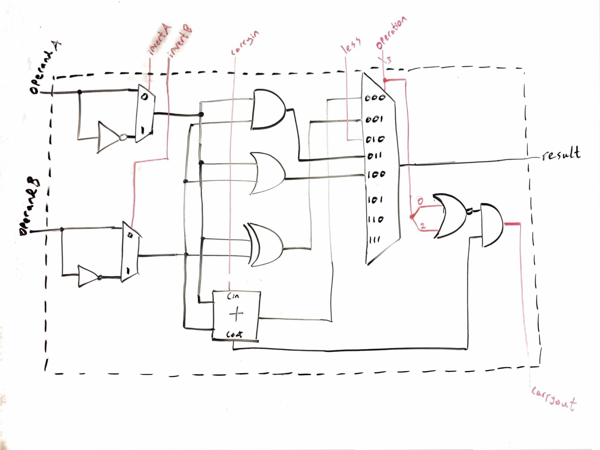
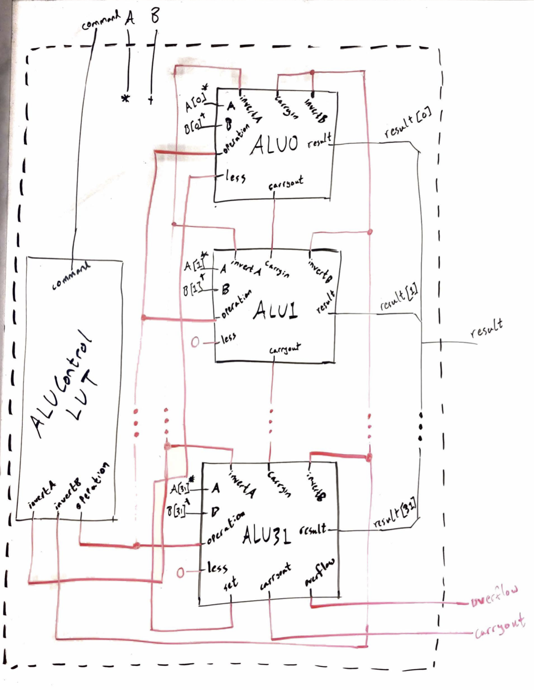
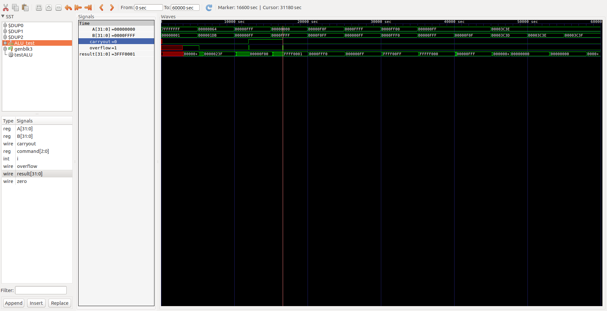

***Computer Architecture***
***Lab 1 Report***
***Joseph Lee and Sam Myers***
***10/12/2017***

### Implementation
We implemented our ALU using a bitslice approach in which all but the most significant bit are identical slices (the MSB is a slightly modified version of every other bitslice ALU). The carry-ins for each bit slice are hooked up to the previous carry-outs, as one would expect. The block diagrams below (figures 1 and 2) show our bitslice implementations.

One interesting thing that we did is we have two flags internal to each bit in the slice that allows us to invert one or both of the operands. This gives us the flexibility to implement multiple operations with the same gates using DeMorgan’s law (NAND from OR, NOR from AND) as well as subtraction and SLT by inverting only the second input.

We implemented SLT by having an extra “less” control signal that feeds directly into the corresponding terminal of the 1-bit ALU multiplexer. For every bit but the least significant, this signal is hard-coded to 0; the ALU for the most significant bit outputs a “set” signal directly from its 1-bit adder that loops back into the least significant bit’s “less” input. Since the control signals for SLT are the same as for subtraction, the “set” signal corresponds to the most significant bit of the difference between the inputs.

Another interesting implementation approach that allowed us to have our adder always connected to the inputs without incorrectly raising overflow, carryout, or zero flags is that we included a small logic block to determine if the adder was being used (NOR the bits of the operation signal, since addition and subtraction both use 000) and only output those flags if appropriate.

*Figure 1: Block diagram of the 1-bit ALU used for bits 0-30.*

*Figure 2: Block diagram of the 1-bit ALU used for bit 31.*

*Figure 3: Block diagram of the 32-bit ALU.*

### Test Results
For our 1 bit ALU testbench we conducted pseudo-exhaustive testing. We quickly determined that truly exhaustive testing would not be feasible or necessary based on the total number of input bits of each 1-bit ALU. Each 1-bit ALU has inputs A, B, invertA, invertB, carryin, less, and a 3 bit operation control signal meaning that a truly exhaustive test would require 2^7 or 128 test cases. However, it is readily apparent that if we verify that invertA and invertB do in fact invert A and B respectively then it is not necessary to test them in every case. This reduced the number of necessary tests to 32. We further reduced the number of tests by abbreviating our test cases for the SLT function since SLT is a function that really does not make much sense in the context of a single bit. Since some of our logic functions rely on invertA and invertB working properly, separately testing invertA and invertB was not necessary reducing our total number of test cases to 30, a much more reasonable number.

For our 32-bit ALU test bench we performed mostly edge case testing and just enough tests to convince ourselves that it was working as intended. For our ADD operation this meant testing a scenario that overflowed and contained a carryout as well as a simple regular addition. For our overflow case we chose to add 0x7FFFFFFF with 0x1 as this was a simple case that would validate our overflow and carryout behavior. For the normal addition we just tested adding 100 to 475. For our subtract we decided to test one case in which the result was negative and one in which the result was positive. For this we just used simple hex numbers for simplification. For our logic functions we decided that one test case for each was sufficient since we had exhaustively tested the logic portion of the 1-bit ALU. For these tests we again just used simple hex numbers of 0s and Fs just to simplify the expected results. To test our SLT function we decided that there were 3 important cases: A < B, A > B and A = B and that one of each case would be sufficient to convince ourselves that SLT was working properly. We just random decimal numbers to implement these cases.

Our test bench caught quite a few flaws in our implementation. Initially we were seeing an undefined value on most of our outputs. We quickly traced this back to missing brackets in our definition of our 8 to 1 multiplexer. We also found that our test cases caught a simple (but at first hard to find) bug in our implementation of NAND. This case was particularly cool in that our approach to finding it was to create a truth table for the output of “NAND”. Our truth table had the exact behavior of NOR. Immediately this prompted us to look for our OR gate. Sure enough we had accidentally copied and pasted `AND there instead of OR. Our test bench also caught a lot of errors around improper handling of the flags where carryout would sometimes be high when performing a logic function. We fixed this by adding our internal flags useCarryout and useOverflow.

We also ran into cases where in the development process we added specific test cases to better understand the results we were getting. One example of this is that our adder was returning about half undefined values and the rest were defined (and correct). We tried plugging in a few different values for the operands to look for any patterns in the bug. This led us to eventually find that the bigger the result was supposed to be, the more bits were undefined. We eventually traced this back to a timing problem - we were not waiting long enough before reading our output state.
### Timing Analysis
#### Timing analysis of ADD function:
Based on our GTKwave analysis the worst case propagation delay of our add function is 3060 ticks. This seems reasonable as the add function is serial meaning that the propagation delay of each bit adds to the total propagation delay.
#### Timing analysis of Subtract function:
Since our subtract is implemented using our adder and an inverter, the worst case propagation delay for the subtract function would be 3070 ticks. We could verify this using simulation if we set up a worst case test in terms of propagation delay (something in which the result is 0xFFFFFFFF. (note, in our initial testbench we accidently used 4 character hexadecimal numbers which correlates to 16 bits instead of 32. This is the reason why we do not currently have a subtract worst case test case. We could implement this by doing 0xFFFFFFFF - 0).
#### Timing analysis of XOR function:
Since our XOR function is a parallel operation (as are all of the basic logic functions) it makes sense that our propagation delay is significantly shorter at 150 ticks.
#### Timing analysis of AND function:
Our AND function also has a propagation delay of 150 ticks which makes sense given that its implementation is very similar to XOR.
#### Timing analysis of NAND function:
Our NAND propagation delay is 240 ticks which makes sense given that our implementation is to invert both operands and pass into an OR gate. We get additional propagation delay from the multiplexer that selects the inverted operands. In hindsight we should have implemented these the opposite way so that NAND and NOR were our basic gates and the other logic functions implemented by manipulating the inputs.
#### Timing analysis of NOR function:
Our NOR propagation delay was also 240 ticks which makes sense since it is implemented in the same way that NAND is implemented.
#### Timing analysis of OR function:
Our OR propagation delay is 240 ticks as well. We wanted to look at this analytically taking a deeper look at our implementation since our intuition said that the OR propagation delay should be more similar to AND and OR, but we ran out of time.
#### Timing analysis of SLT function:
Our SLT propagation delay was 3070 ticks which makes sense as it is effectively implemented as a subtract operation.

*Figure 4: Waveforms showing the time delay for ALU operations.*

### Work Plan Reflection
Our work plan was actually fairly accurate in predicting the total time spent. The exact distribution of time did vary slightly between our plan and what we actually did - mostly due to parallelization that we did not anticipate being possible (we were able to write the 32-bit implementation in parallel with our 1 bit bit-slice). Our test bench for the 1-bit ALU ended up taking significantly longer than the full 32-bit test bench (about 3 hours for the 1-bit and an hour and half for the 32-bit). This was due to the fact that the 1-bit test bench needed to be more exhaustive, that more of the control lines were exposed and had to be manually set. Also most of the code for the 1-bit ALU test bench was reusable in the 32-bit test bench implementation, speeding up the development time.
